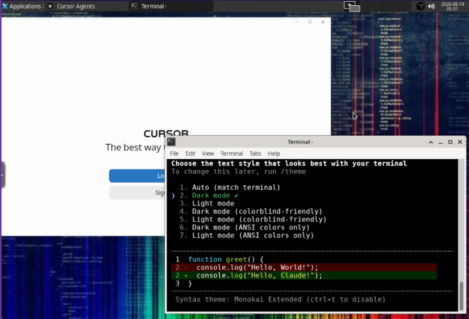

# code-box

[](./docker-compose.yaml)
[](./LICENSE)
[](https://github.com/zjgordon/code-box/releases)

Wanted to play with all the fun stuff in as much of a walled garden as possible. Full dev box in a browser (**XFCE** + **KasmVNC**) with **isolated Docker** and  **Cursor**, **VS Code**, **Claude Code**, and **OpenCode**. Optional **Ollama** container to host a local LLM for **OpenCode**. Run it locally over HTTP and open projects in `/workspace`.



## Requirements

- Docker Engine with Compose v2

Isolated Docker requires [Sysbox](docs/sandbox-docker.md) on the host. Ollama GPU requires NVIDIA drivers and the [Container Toolkit](docs/ollama.md).

## Quick start

```bash
cp .env.example .env   # set CODE_BOX_USER and CODE_BOX_PASSWORD
docker compose build && docker compose up -d
```

Open [http://localhost:3000](http://localhost:3000) (or `http://<host-ip>:3000` on your LAN), sign in, then run `claude login` in a desktop terminal. For OpenCode, use `/connect` in the TUI to configure an LLM provider. To clone and manage GitHub repos over SSH (MFA-compatible), see [docs/github.md](docs/github.md). Agents use Playwright, GitHub, and Fetch MCP; see [docs/mcp.md](docs/mcp.md) (Playwright details: [docs/browser.md](docs/browser.md)). For other layouts (LAN reverse proxy, HTTPS on a personal server), see [docs/deployment_examples.md](docs/deployment_examples.md).

Optional: set `CODE_BOX_PORT` in `.env` if host port `3000` is taken.

Resources (defaults work for agent/desktop use; override in `.env`): `CODE_BOX_MEMORY_LIMIT` (16G), `CODE_BOX_CPUS` (8.0), `CODE_BOX_SHM_SIZE` (1gb).

## Optional: GitHub

To clone, review, and manage public GitHub repositories from the desktop (`gh`, SSH, MFA, Verified commits), see [docs/github.md](docs/github.md).

## Agent MCP tools

Agents in Cursor, Claude Code, and OpenCode share Playwright (browser), GitHub (API + Actions), and Fetch (HTTP → markdown). See [docs/mcp.md](docs/mcp.md). Playwright details: [docs/browser.md](docs/browser.md).

## Optional: isolated Docker

To give the desktop a sandboxed Docker Engine (Sysbox sibling DinD, not the host socket), see [docs/sandbox-docker.md](docs/sandbox-docker.md).

## Optional: Ollama

To host a local model for OpenCode (optional sibling container; NVIDIA GPU is a second overlay), see [docs/ollama.md](docs/ollama.md).

## Versioning

- **Releases:** git tags `vMAJOR.MINOR.PATCH` (see [Releases](../../releases))
- **Image tag:** `local/code-box:<CURSOR_VERSION>` (default `3.14`)
- **Build pins** (override in `.env`): `CURSOR_VERSION`, `NODE_VERSION`, `NVM_VERSION`, `CLAUDE_CODE_VERSION`, `OPENCODE_VERSION`, `PLAYWRIGHT_MCP_VERSION`, `GITHUB_MCP_VERSION`, `FETCH_MCP_VERSION`

```bash
scripts/update-cursor.sh
# bump CURSOR_VERSION, then rebuild (apt/Node/extension layers stay cached):
docker compose build && docker compose up -d
```

Use `docker compose build --no-cache` only when you need a fully clean rebuild. BuildKit (Docker’s default) caches apt/npm downloads across builds.

## Data

| Host | Container |
|------|-----------|
| `./data/config` | `/config` |
| `./data/workspace` | `/workspace` |
