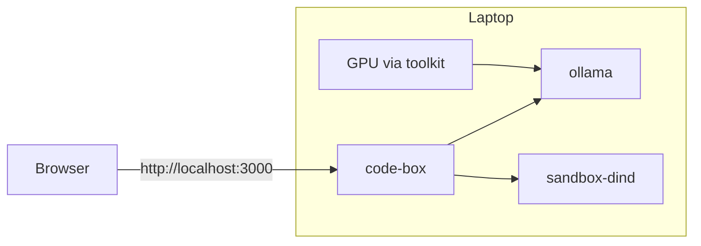
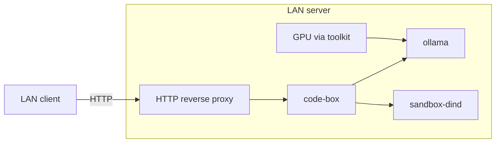
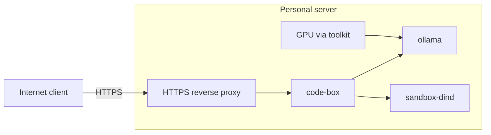

# Deployment examples

Same Compose pieces — `code-box`, GPU-backed [Ollama](ollama.md), contained [Docker via Sysbox](sandbox-docker.md) — different network edge. Reverse proxy, TLS, and firewall stay off `sandbox-net`. NVIDIA Container Toolkit attaches the GPU to Ollama.

KasmVNC serves plain HTTP on port 3000, bound to all interfaces. Plain HTTP is only appropriate on a single local workstation. For anything else (LAN, and especially the internet), terminate HTTPS at a reverse proxy, and don't publish `:3000` beyond the proxy. See [threat-model.md](threat-model.md) for what else to tighten.

## Laptop — localhost HTTP

Browser to KasmVNC on loopback. No reverse proxy. Ollama’s host port is `127.0.0.1`.

## LAN server — HTTP reverse proxy

LAN clients reach `code-box` through an HTTP reverse proxy. Fine for a trusted home LAN; KasmVNC credentials cross the network in cleartext, so prefer the HTTPS layout below on shared networks. The proxy is the published HTTP front door. GPU and contained Docker stay on the server.

## Personal server — HTTPS reverse proxy

Internet clients reach `code-box` through an HTTPS reverse proxy. TLS terminates at the proxy. GPU and contained Docker stay on the server.

