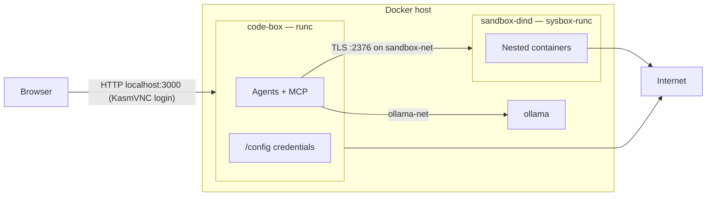

# Threat model

What "walled garden" means in code-box: which boundaries hold, which are deliberately open, and what to tighten for your own setup.

Implementation tracker: [walled-garden-hardening-plan.md](walled-garden-hardening-plan.md).

## Scope

code-box is a **single-user** dev box for running coding agents (Cursor, Claude Code, OpenCode) with a reduced blast radius. It is **not** multi-tenant, not a hardened sandbox against a determined container escape, and not an egress firewall.

There are two available profiles and one deferred profile:

| Profile | Command | Docker and credentials |
|---------|---------|------------------------|
| **Local functional development** (default) | `scripts/up.sh` or `scripts/up.sh --profile local-functional` | No desktop Docker daemon or host socket; desktop retains `/config` and broad egress |
| **Contained build execution** | `scripts/up.sh --profile contained-build` (needs [Sysbox](sandbox-docker.md#host-requirements)) | Sysbox sibling `dockerd` over mutual TLS; DinD sees `/workspace`, never `/config` |
| **Protected agent operation** | Not available yet | Deferred until WG-06 credential scoping and WG-07 egress policy |

`--sandbox` remains a compatibility alias for `--profile contained-build`. Profile detail and guarantees: [profiles.md](profiles.md).

## Assets

- **Host**: kernel, Docker socket, filesystem, LAN.
- **`/config`** (host `./data/config`): `gh` token, SSH keys, Claude/Cursor/OpenCode auth state.
- **`/workspace`** (host `./data/workspace`): your source.
- **KasmVNC login** (`CODE_BOX_USER` / `CODE_BOX_PASSWORD`).
- **Ollama** models and GPU (when enabled).

## Threats in scope

1. **A misbehaving or prompt-injected agent** (primary). It runs as the desktop user, with the tools and credentials that user has.
2. **Malicious code in dependencies or images** that agents build and run.
3. **Network attackers** reaching the KasmVNC port.

## Trust boundaries



`/workspace` is bind-mounted into both code-box and sandbox-dind. `/config` is mounted only into code-box.

## What holds

| Boundary | Evidence |
|----------|----------|
| No host Docker socket in either mode, and no `dockerd` inside code-box | [`docker-compose.yaml`](../docker-compose.yaml), [`docker-compose.sandbox.yaml`](../docker-compose.sandbox.yaml) |
| Sandbox mode: agents talk only to a sibling `dockerd` under Sysbox (user-namespaced, no `--privileged`) over mutual TLS | [`sandbox-dind/docker-compose.yaml`](../sandbox-dind/docker-compose.yaml), [`scripts/generate-dind-certs.sh`](../scripts/generate-dind-certs.sh) |
| sandbox-dind publishes no host ports and is reachable only on `sandbox-net` | [`sandbox-dind/docker-compose.yaml`](../sandbox-dind/docker-compose.yaml) |
| `/config` (tokens, SSH keys, agent auth) is never mounted into DinD. Nested containers see `/workspace` only | [`sandbox-dind/docker-compose.yaml`](../sandbox-dind/docker-compose.yaml) |
| Lab stacks (Traefik, Gitea, Ollama, proxies) stay off `sandbox-net`. The Ollama loopback proxy binds `127.0.0.1` only, so nested containers can't reach it through code-box | [`docker-compose.ollama.yaml`](../docker-compose.ollama.yaml), [ollama.md](ollama.md) |
| Resource limits: memory, CPU, PIDs, and bounded local logs on code-box, sandbox-dind, Ollama, and the Ollama proxy | compose files, `.env` overrides, [`test-containment.sh`](../scripts/test-containment.sh) |
| Credentials live on the `/config` volume and are not baked into the image. TLS PEMs and `.env` are gitignored | [`.gitignore`](../.gitignore), [github.md](github.md) |
| KasmVNC refuses to start without credentials (`.env.example` ships a blank password; `up.sh` also rejects `changeme`) | [`.env.example`](../.env.example), [`scripts/up.sh`](../scripts/up.sh) |
| code-box uses Docker's default seccomp profile; the unconfined exception is a separate, explicit compatibility overlay | [`docker-compose.yaml`](../docker-compose.yaml), [`docker-compose.seccomp-unconfined.yaml`](../docker-compose.seccomp-unconfined.yaml), [`test-containment.sh`](../scripts/test-containment.sh) |
| KasmVNC publishes only to `127.0.0.1` by default | [`docker-compose.yaml`](../docker-compose.yaml), [`.env.example`](../.env.example), [`test-containment.sh`](../scripts/test-containment.sh) |
| Container images use immutable digests and direct build artifacts have reviewed SHA-256 checksums | [`Dockerfile`](../Dockerfile), Compose files, [supply-chain.md](supply-chain.md), [`test-supply-chain.sh`](../scripts/test-supply-chain.sh) |

## Deliberately open

| Open | Why | Tighten |
|------|-----|---------|
| **`sandbox-net` has full egress** | Nested pulls and builds need registries and package mirrors | Host firewall on the `sandbox-net` bridge, an egress proxy, a private registry mirror |
| **code-box has full egress** | Agents need model APIs, GitHub, package registries | Host firewall / egress proxy with an allowlist |
| **GitHub MCP uses your full `gh` token scopes** (not read-only) | One login for `gh`, git, and agents | Log `gh` in with a fine-grained PAT scoped to specific repos. Set `GITHUB_READ_ONLY=1` or a narrower `GITHUB_TOOLSETS` for the MCP. Protect `main` with branch protection / required reviews |
| **Fetch MCP ignores robots.txt and can reach loopback and lab DNS** (`127.0.0.1`, `ollama`, `sandbox-dind`) | Agent doc fetches; same reach as `curl` in a terminal, so not a new hole | Egress policy (above) covers it too |
| **Optional unconfined seccomp compatibility overlay** | Some older Docker/libseccomp combinations can block GUI or Electron syscalls. It is not needed for Chromium's sandbox; those processes run with `--no-sandbox` (below) | Keep Docker's default profile. Select `--seccomp-unconfined` only after confirming a specific compatibility failure, then update Docker/libseccomp and retest |
| **Electron apps and Playwright Chromium run with `--no-sandbox`** | Chromium's own sandbox can't run in this container | Treat the browser as running at the desktop user's privilege. Don't browse untrusted sites with credentials loaded |
| **Passwordless `sudo` for the desktop user** (from the linuxserver base image) | Agents install packages ad hoc | Assume the agent is root *inside* code-box. The container is the boundary |
| **code-box runs under the default `runc`**, not Sysbox | KasmVNC/Electron compatibility. Only DinD needs Sysbox | Combined with passwordless root inside the container, this remains a weaker boundary than the Sysbox DinD sibling. Keep the host kernel patched |
| **KasmVNC is plain HTTP when explicitly exposed beyond loopback** (`CODE_BOX_BIND_ADDRESS=0.0.0.0`) | Trusted-LAN and reverse-proxy deployments need a host-accessible listener | Keep the default loopback bind. For any non-localhost access, put an [HTTPS reverse proxy](deployment_examples.md) in front and restrict network access to it |
| **Nested containers can reach code-box on `sandbox-net`** | code-box must join `sandbox-net` to reach the daemon | Anything listening on `0.0.0.0` inside code-box (including KasmVNC :3000, which needs its login) is reachable from nested containers. Bind agent dev servers to `127.0.0.1` |
| **`/workspace` is shared read-write with DinD** | Compose bind mounts must resolve on the daemon | Nested containers can modify source and leave root-owned files. Review diffs before pushing |

## Hardening checklist

- [ ] Strong, unique `CODE_BOX_PASSWORD`.
- [ ] Non-localhost access goes through an HTTPS reverse proxy. Don't expose `:3000` directly to the internet.
- [ ] Use the contained-build profile (`scripts/up.sh --profile contained-build`) whenever agents need Docker. Never mount the host socket "just this once".
- [ ] `gh` logged in with a fine-grained PAT limited to the repos you work on. Branch protection on `main`.
- [ ] SSH key has a passphrase (session `ssh-agent` handles prompts; see [github.md](github.md)).
- [ ] Egress policy on the host if agents or nested builds shouldn't reach arbitrary hosts.
- [ ] Keep Traefik, Gitea, Ollama, and other lab services off `sandbox-net`.
- [ ] Rotate DinD TLS certs periodically: `FORCE=1 ./scripts/generate-dind-certs.sh`, then recreate both stacks.
- [ ] Monitor Docker host disk usage. `dind-storage` is intentionally not quota-managed by Compose.

## Testing seccomp

The base configuration uses Docker's default seccomp profile. Verify the shipped image and containment controls without touching operator state:

```bash
scripts/test-containment.sh
```

The test reports `Seccomp: 2` for the disposable desktop. It also verifies that the explicit compatibility overlay changes a disposable process to `Seccomp: 0`.

If a supported desktop tool has a confirmed default-profile incompatibility on a specific host, use the exception only for that host:

```bash
scripts/up.sh --seccomp-unconfined
docker exec code-box grep Seccomp /proc/1/status   # expect "Seccomp: 0"
```

For a manual Compose invocation, apply [`docker-compose.seccomp-unconfined.yaml`](../docker-compose.seccomp-unconfined.yaml) explicitly with `-f`. Retest after updating Docker or libseccomp, then remove the exception. The compatibility overlay is never selected implicitly.
